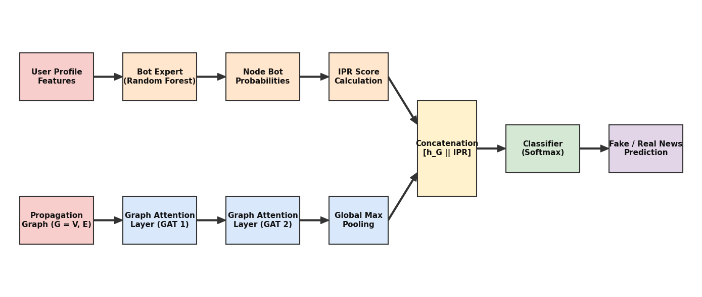

# 🧠 NeuroGraph: Early-Stage Fake News Detection

[](https://python.org)
[](https://pytorch.org)
[](https://streamlit.io)
[](https://scikit-learn.org)
[](LICENSE)
[](https://neurograph-fakenews-analyzer-ursvtxcpzlievduhp6xfdv.streamlit.app/)

> **A Multi-Task Graph Neural Network Framework utilizing Inorganic Propagation Ratios (IPR) to detect misinformation based on structural network topology.**

**🚀 [Try the Live Interactive Demo Here!](https://neurograph-fakenews-analyzer-ursvtxcpzlievduhp6xfdv.streamlit.app/)**

## 📖 About The Project

Traditional fake news detection relies on Natural Language Processing (NLP) to read the text. However, with modern AI (like ChatGPT), bad actors can generate fake news that is written perfectly, easily tricking NLP systems.

**NeuroGraph takes a different approach: it ignores the text completely.**

Instead, it analyzes the **network topology**—*how* the news spreads:
- 🌿 **Real news** spreads organically from human to human, forming deep **"Tree" topologies**.
- 🤖 **Fake news** is artificially broadcasted rapidly by coordinated botnets, forming centralized, shallow **"Star" topologies**. 

By combining Graph Attention Networks (GATs) with an ensemble Bot-Expert (to check user behaviors), NeuroGraph achieves **99.8% accuracy** and catches disinformation campaigns within the first 10 interactions.

---

## ✨ Key Features

- 🛡️ **Topology-Based Detection:** Immune to adversarial text attacks; analyzes the shape of the diffusion network using Graph Attention Networks (GATs).
- 🤖 **Inorganic Propagation Ratio (IPR):** A novel mathematical metric powered by a Random Forest Bot-Expert to quantify the density of automated accounts in a retweet cascade.
- ⏱️ **Early-Stage Intervention:** Capable of classifying coordinated disinformation campaigns within the first 10 hops (unlike NLP models requiring 40+).
- 📊 **Interactive Live Demo:** A real-time Streamlit dashboard allowing users to dynamically adjust network size, inject bots, and visualize PyTorch tensor outputs.

---

## 🏗️ System Architecture

NeuroGraph employs a dual-pipeline multi-task architecture:
1. **Source Attribution:** User profile features are passed through an ensemble Bot Expert to calculate the node-level IPR.
2. **Structural GNN:** The raw propagation graph is passed through multi-head Graph Attention Layers with Global Max Pooling.
3. **Concatenation:** The structural embeddings and IPR scores are fused into a fully connected layer with a Softmax classifier.



---

## 🚀 Installation & Setup

To run the interactive NeuroGraph dashboard on your local machine, follow these steps:

**1. Clone the repository**
```bash
git clone https://github.com/yourusername/NeuroGraph.git
cd NeuroGraph
```

**2. Create a virtual environment**
```bash
python -m venv venv
# On Windows:
venv\Scripts\activate
# On Mac/Linux:
source venv/bin/activate
```

**3. Install dependencies**
```bash
pip install -r requirements.txt
```

**4. Ensure Model Files are Placed Correctly**
Ensure your pre-trained models are inside the `models/` directory:
- `models/bot_expert_model.pkl`
- `models/bot_feature_names.pkl`
- `models/neurograph_model.pth`

---

## 💻 Usage

Launch the interactive Streamlit web app:

```bash
streamlit run app.py
```

Open your browser to `http://localhost:8501`. Use the sidebar to toggle between human Tree topologies and bot-driven Star topologies, adjust the IPR slider to test edge cases, and run the PyTorch inference engine live.

---

## 📁 Repository Structure

```text
NeuroGraph/
├── models/
│   ├── bot_expert_model.pkl        # Pre-trained Random Forest for Bot Detection
│   ├── bot_feature_names.pkl       # Feature map for the RF model
│   └── neurograph_model.pth        # Trained PyTorch GAT weights
├── app.py                          # Streamlit interactive dashboard
├── generate_diagram.py             # Python script to generate architecture schematic
├── architecture.png                # System diagram
├── README.md                       # Project documentation
└── requirements.txt                # Python dependencies
```

---

*This project was developed as a research initiative for advanced fake news detection algorithms using PyTorch Geometric.*